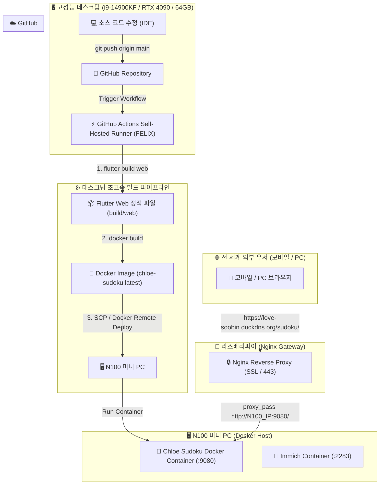

# 🏛️ Chloe Ranker (Chloe Sudoku) Home Lab DevOps & CI/CD Architecture

## 1. 개요 (Overview)
본 문서는 **Chloe Sudoku (클로이 랭커)** 프로젝트의 소스 코드 변경 시 **고성능 데스크탑(Self-Hosted Runner)**의 초고속 CPU 성능으로 Flutter Web 및 Docker 이미지를 빌드하고, **N100 미니 PC(Docker 호스트)**에 자동 배포되며, **라즈베리파이(Nginx 게이트웨이)**를 통해 전 세계 외부 사용자가 안전하게 접속할 수 있는 **전체 파이프라인 아키텍처 및 구축 가이드**입니다.

---

## 2. 전체 시스템 아키텍처 다이어그램 (Architecture Diagram)



---

## 3. 구성 요소별 역할 정리 (Component Roles)

| 구성 요소 | 장비 / 스펙 | 역할 및 담당 업무 |
| :--- | :--- | :--- |
| **개발자 PC** | i9-14900KF / 64GB RAM | 코드 작성 (`git push`) 및 **Self-Hosted Runner (`FELIX`)** 구동 (초고속 빌드 수행) |
| **저장소** | GitHub Private Repo | 소스 코드 버전 관리 및 CI/CD 워크플로우 이벤트 트리거 |
| **Docker 호스트** | N100 미니 PC | **Chloe Sudoku Docker 컨테이너 (`:9080`)** 및 Immich 컨테이너 상시 가동 |
| **웹 게이트웨이** | 라즈베리파이 (`192.168.55.81`) | SSL(HTTPS) 암호화, DuckDNS 도메인 수신 및 **Nginx 라우팅 (`proxy_pass`)** |
| **외부 접속 주소** | DuckDNS | `https://love-soobin.duckdns.org/sudoku/` |

---

## 4. N100 미니 PC Docker 설정 가이드 (포트 9080)

### 4.1 Docker 구동 명령어 (N100 서버 터미널)
```bash
docker run -d --name chloe-sudoku --restart always -p 9080:80 -v /home/felix530/project/sudoku-web:/usr/share/nginx/html:ro nginx:alpine
```

---

## 5. 비밀번호 없는 무인 SSH 자동 배포 등록 가이드 (Passwordless SSH)

데스크탑에서 N100 미니 PC로 SCP 파일 전송 및 SSH Docker 재시작 명령을 내릴 때, **비밀번호를 입력받지 않고 3초 만에 무인 자동 배포**가 수행되도록 SSH 공개키를 등록하는 방법입니다.

### 5.1 데스크탑 SSH 공개키 (Public Key)
```text
ssh-ed25519 AAAAC3NzaC1lZDI1NTE5AAAAICQdtFbW26vZ2bnpIjcjDfD8T0CGNC61ApW7gt2XGsQr fromj@felix
```

### 5.2 N100 미니 PC 터미널 등록 명령어 (MobaXterm 실행)
```bash
echo "ssh-ed25519 AAAAC3NzaC1lZDI1NTE5AAAAICQdtFbW26vZ2bnpIjcjDfD8T0CGNC61ApW7gt2XGsQr fromj@felix" >> ~/.ssh/authorized_keys && chmod 600 ~/.ssh/authorized_keys
```

---

## 6. 라즈베리파이 Nginx 최종 라우팅 구문 (`/etc/nginx/sites-available/immich`)

```nginx
server {
    listen 443 ssl;
    server_name love-soobin.duckdns.org;

    # 1. Immich 서비스 (N100 미니 PC :2283)
    location / {
        proxy_pass http://192.168.35.137:2283;
        proxy_set_header Host $host;
        proxy_set_header X-Real-IP $remote_addr;
        proxy_set_header X-Forwarded-For $proxy_add_x_forwarded_for;
        proxy_set_header X-Forwarded-Proto $scheme;
    }

    # 2. Chloe Sudoku 서비스 (N100 미니 PC :9080)
    location /sudoku/ {
        proxy_pass http://<N100_IP>:9080/;  # <-- 포트 9080 적용 및 끝에 슬래시(/) 필수!
        proxy_set_header Host $host;
        proxy_set_header X-Real-IP $remote_addr;
        proxy_set_header X-Forwarded-For $proxy_add_x_forwarded_for;
        proxy_set_header X-Forwarded-Proto $scheme;
    }
}
```
